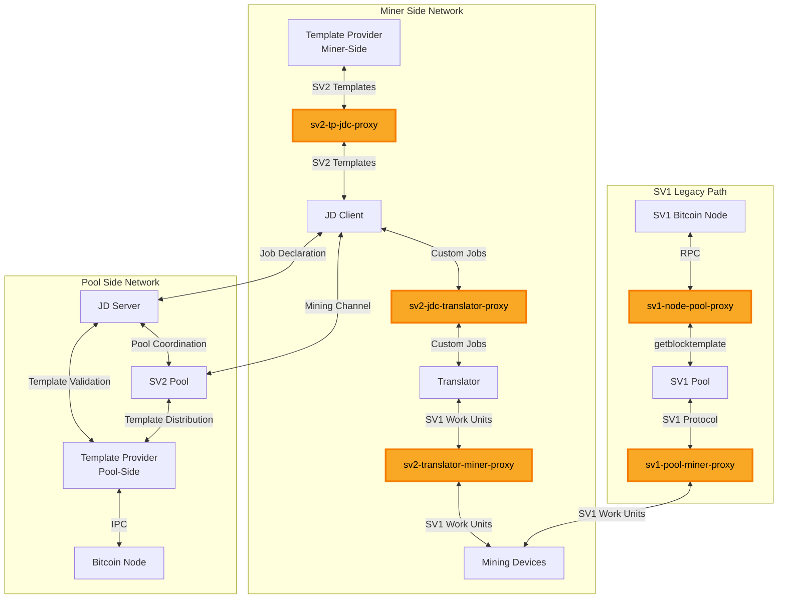

# FOSS@MARA Stratum V2 Benchmarking

## Abstract

This document presents the results of a ~4-day benchmarking experiment comparing the Stratum V1 (Sv1) and Stratum V2 (Sv2) protocols in a mining setting. Using a fleet of ten Antminer S21Imm, the study compared hashrate performance, latency, and network traffic between the two protocols, highlighting significant advantages for Sv2, including faster block propagation and lower stale share rates. The results demonstrate the superiority of Sv2 over Sv1 in several key areas, with implications for large-scale mining operations looking to optimize their technology stack.

## Introduction

This report presents the results of a comprehensive benchmarking experiment comparing the performance of Stratum V1 (Sv1) and Stratum V2 (Sv2) protocols in a real-world mining scenario. The study aimed to evaluate the advantages and disadvantages of each protocol stack, with a focus on latency, network bandwidth usage, and mining efficiency.

The results are presented in this report, along with accompanying graphs and charts that provide a visual representation of the key findings. These graphs can be used to compare the performance of Sv1 and Sv2 protocols in different scenarios, and gain insights into their strengths and weaknesses. To directly inspect our data using Prometheus/Grafana, please see [Restoring Data to Prometheus](#restoring-data-to-prometheus).

For those interested in learning more about the benchmarking tool, please visit the benchmarking-tool repository [on GitHub](https://github.com/stratum-mining/benchmarking-tool). This repository includes the source code for the benchmarking tool, as well as documentation on how to run the experiment and initial analysis using cpu-miners.

Note that this report focuses on the results of our specific experiment, and does not provide a general guide on how to use the benchmarking tool or replicate the experiment. If you have any questions or would like to learn more about the experiment methodology, please reach out to <gary.krause@mara.com>.

An initial benchmarking experiment was conducted in Sep 2024 but was not publicly released. This document has been updated to reflect that latest iteration of the benchmark but git history preserves previous experiment results.

## Methodology

The [Stratum V2 (Sv2) protocol](https://stratumprotocol.org) team provides [a suite of Docker containers](https://github.com/stratum-mining/benchmarking-tool) that can be run to observe Sv2 vs it's predecessor, SV1. This suite provides metrics across several domains for each protocol and provides objective measurement from an engineering viewpoint. Researching how to optimize MARA engineering technology stack, we conducted a ~4 day benchmarking experiment. A fleet of ten Antminer S21Imm were allocated to the experiment. Half would mine with the Stratum v1 (Sv1) protocol and the half with Sv2 for the duration of the experiment. Of the Sv2 allocated miners, four were running MARA Firmware and one was running Braiins OS; for Sv1, three were running MARA Firmware and two running Braiins OS. A VM was allocated for the benchmarking suite with 16 vCPUs, 24GB RAM and 750GB SSD storage; running Ubuntu 22.04 and Docker v27.0. The benchmarking tool git repository was at commit hash 3db631b1915b55e87aeacf3024c3c0bbc77cbf7b in a [forked repository branch](https://github.com/average-gary/benchmarking-tool/tree/update-to-1.5.0) when the benchmark was ran. This fork is several commits ahead of the official `benchmarking-tool` repository because it updated the Sv2 components to the latest tagged release of the Stratum v2 Reference Implementation (SRI). The latest SRI release at the time of this benchmarking is v1.5.0.

Two configurations are provided for benchmarking. Configuration A allows for a miner to use Sv1 firmware to mine with a Sv2 pool while selecting their own block template using Job Declaration. Configuration C also allows Sv1 firmware mining using a Translator Proxy but does not use Job Declaration. Configuration A uses the full capabilities of Sv2 so we opted to utilize that in our benchmarking. Additionally, the MARA operations team finds the modularity and optionality of these various configurations to be a positive development for pool mining technology. There are other configurations of stratum that remove the need for a Sv1->Sv2 Translator but these assume miner firmware to be Sv2 enabled. Currently, the only known Stratum v2 enabled firmware are MARA Firmware and Braiins OS. We did confirm successful mining via Sv2 only but for the sake of replicating the original findings for comparison, we connected to the Sv1 Translator with all mining appliances.

During the experiment we had to patch the Sv1 public-pool instance due to timing errors. At this time, Testnet4 is under a timewarp attack that the software did not account for. This can be seen in the Sv1 Mined Blocks graph. This conflict and the general nature of testnet4 may also have impacted the staleness of shares but given the small delta between this experiment and the last experiment, we did not conclude share staleness were dismissive of other findings of importance.

### Tool Suite

A list of Docker containers in the suite of tools used during the benchmark. More details can be found in the Sv2 [benchmarking-tool repository](https://github.com/stratum-mining/benchmarking-tool). Configuration changes for each tool is also listed.

#### Builders

Several builder images were used for creating artifacts for use in other containers.

1. sv2-roles.dockerfile - builds sv2-roles binaries from the stratum repository
2. sv2-custom-proxy/Dockerfile - builds sv2-custom-proxy
3. sv1-custom-proxy/Dockerfile - builds sv1-custom-proxy
4. log-server/Dockerfile - builds log-server
5. pools-latency-calculator/Dockerfile - builds pools-latency-calculator

#### Bitcoin Nodes

- template-provider-pool-side - Pool-side Bitcoin node that validates custom block templates submitted by miners through the Job Declaration Protocol, providing SV2 template distribution
- template-provider-miner-side - Miner-side Bitcoin node that enables custom block template construction, allowing miners to select their own transactions via SV2 template distribution
- sv1-node-pool-side - Traditional Bitcoin node serving the Stratum V1 pool for legacy block template creation via `getblocktemplate` RPC and block broadcast

##### Template Provider Node Implementation

The template provider nodes use Bitcoin Core v30.0rc1 downloaded directly from bitcoincore.org paired with the standalone sv2-tp binary v1.0.2 from https://github.com/Sjors/sv2-tp. Bitcoin Core v30.0 includes multiprocess architecture support, enabling the `bitcoin-node` daemon to run with Unix IPC bindings (`ipcbind=unix`). The sv2-tp binary, developed separately as a Stratum V2 template provider, connects to the `bitcoin-node` process via a Unix domain socket at `/root/.bitcoin/testnet4/node.sock`. This architecture allows sv2-tp to interface with Bitcoin Core's consensus engine through efficient binary IPC communication rather than JSON-RPC, enabling push-based template updates and supporting the Job Declaration Protocol for custom transaction selection by miners.

##### SV1 Node Implementation

The sv1-node-pool-side runs standard Bitcoin Core v30.0rc1 as a traditional single-process bitcoind daemon without leveraging the multiprocess capabilities or IPC bindings. The SV1 pool communicates with this node exclusively through HTTP JSON-RPC calls, using the legacy `getblocktemplate` and `submitblock` commands to retrieve block templates and broadcast solved blocks.

#### Pool

> Mining Appliances -Sv1-> Translator -Sv2-> JDC -Sv2/WAN-> **Pool**/JDS

The _Pool_ role of Sv2. This pool does not have user account nor other features a normal public pool and just serves as a centralized coordinator for hashrate in this setup. For this benchmarking, the pool config (custom-configs/sri-roles/config-a/pool-config-a-docker-example.toml) was modified to mine to an appropriate `coinbase_reward_script` and update the `pool_signature`.

#### Job Declaration Server

> Mining Appliances -Sv1-> Translator -Sv2-> JDC -Sv2/WAN-> Pool/**JDS**

The Job Declaration Server (JDS) role of Sv2. The JDS propagates blocks found by miners and is responsible for providing data to the Job Declaration Clients (JDC) so the JDC can create mining jobs for the mining devices. For this benchmarking, the configuration (custom-configs/sri-roles/config-a/jds-config-a-docker-example.toml) was updated with an appropriate `coinbase_reward_script`.

#### Job Declaration Client

> Mining Appliances -Sv1-> Translator -Sv2-> **JDC** -Sv2/WAN-> Pool/JDS

The Job Declaration Client (JDC) role of Sv2. The JDC coordinates with the JDS and distributes mining jobs to mining devices. For this benchmarking, the `coinbase_reward_script` and `pool_signature` were modified. This configuration for the JDC provides a solo-mining fall back in case of connectivity loss or malicious upstream to JDS.

#### Translator

> Mining Appliances -Sv1-> **Translator** -Sv2-> JDC -Sv2/WAN-> Pool/JDS

The Sv2 Translator proxy provides a translation between mining devices that only speak Sv1 protocol. Mining devices allocated to Sv2 connected to this container and shares were proxied to the pool via teh JDC.

#### Mining Appliances

> **Mining Appliances** -Sv1-> Translator -Sv2-> JDC -Sv2/WAN-> Pool/JDS

TODOS: Add description of mining appliances

#### Proxies

Two custom proxy implementations were developed for this benchmarking tool to gather logs, metrics, latency measurements, and bandwidth statistics at critical network links. Source code exists in the https://github.com/stratum-mining/benchmarking-tool under `sv1-custom-proxy/` and `sv2-custom-proxy/`.

##### Proxy Implementations:

- sv1-custom-proxy - Handles Stratum V1 JSON-RPC traffic and Bitcoin Core RPC connections
- sv2-custom-proxy - Handles Stratum V2 binary protocol traffic

##### Metrics Collection:

- Prometheus endpoints for latency and throughput metrics
- Per-connection logging for debugging
- Traffic pattern analysis between mining roles

##### Proxy Architecture

This configuration implements the Job Declaration Client (JDC) architecture with five strategic proxy instances positioned at key measurement points:



##### Proxy Details

| Proxy                      | Type | Connection                               | Purpose                                                                               |
| -------------------------- | ---- | ---------------------------------------- | ------------------------------------------------------------------------------------- |
| sv2-tp-jdc-proxy           | SV2  | Template Provider Miner-Side ↔ JD Client | Measures template distribution from bitcoin-node to JDC for custom block construction |
| sv2-jdc-translator-proxy   | SV2  | JD Client ↔ Translator                   | Measures custom job flow from JDC to translator for SV2→SV1 conversion                |
| sv2-translator-miner-proxy | SV1  | Translator ↔ Mining Devices              | Measures SV1 work distribution to mining devices after protocol translation           |
| sv1-pool-miner-proxy       | SV1  | SV1 Pool ↔ Mining Devices                | Measures legacy SV1 pool traffic to miners for baseline comparison                    |
| sv1-node-pool-proxy        | SV1  | Bitcoin Node ↔ SV1 Pool                  | Measures RPC template requests (getblocktemplate) from SV1 pool to bitcoin node       |

##### Measurement Points

The proxy architecture enables measurement of:

1. SV2 Template Distribution (sv2-tp-jdc-proxy): Binary template updates from bitcoin-node via IPC to JDC over SV2 protocol, capturing the efficiency of push-based template propagation
2. Job Declaration Flow (sv2-jdc-translator-proxy): Custom transaction selection and job submission between JDC and translator, measuring the overhead of miner-selected transaction sets
3. Protocol Translation Overhead (sv2-translator-miner-proxy): Conversion from SV2 binary to SV1 JSON-RPC for miner compatibility, quantifying the translation layer's impact
4. Legacy SV1 Mining (sv1-pool-miner-proxy): Traditional pool→miner work distribution for performance baseline, establishing comparison metrics
5. RPC Template Fetching (sv1-node-pool-proxy): JSON-RPC getblocktemplate polling overhead versus SV2 push-based templates, comparing pull-based versus event-driven architectures

#### Latency Injection

Several components include artificial latency injection capabilities via `monitor_and_apply_latency.sh` to simulate real-world network conditions. This enables controlled testing of performance under more realistic network latency scenarios while maintaining precise metrics collection at each proxy measurement point. 

#### Sv1 Pool

[Public Pool](https://web.public-pool.io/#/) was used as the mining pool for the Sv1 stack. It is an open source software project that enables solo miners and charges no fee. Source code can be found [here](https://github.com/benjamin-wilson/public-pool). During the four day experiment, we patched Public Pool code to account for timing issues relevant to Testnet4.

#### Metric and Logging

Many of the running container facilitated measurements of the experiment and are listed below.

- monitor-traffic-dump - A tool for capturing network traffic.
- prometheus - an industry standard for metrics and alerting
- node-exporter - export machine (hardware/OS) metrics for consumption by prometheus
- cadvisor - analyzes resource usage and performance characteristics of running containers.
- grafana - an analytics and monitoring solution (graphs and charts)
- reporter - a tool for exporting a PDF of grafana dashboards
- renderer - headless browser rendering for grafana panels and dashboards
- pool-latency-calculator - Custom tooling to measure latency to a wide array of public pools so the average latency can be applied within the benchmarking framework
- loki - log aggregation system
- promtail - A log shipper for loki
- log-server - custom code to query loki for logs and bundle them

## Results

This commentary will follow the PDF file SRI-Benchmarking-Report-Oct-2025.pdf and reference a graph(s) by titled name.

> NOTE: Testnet4 is quite irregular compared to mainnet bitcoin due to a timewarping attack. It can be observed at https://fork.observer when selecting testnet4. This impacted mempool regularity and block reward but we believe did not detract from findings overall. More about the timewarp can be found  here:https://github.com/bitcoin/bitcoin/pull/31117. Analysis below will reference the timewarp issue but details are outside the scope of this document.

### Shares and Blocks

Shares and blocks found are considered to ensure both protocol stacks are roughly equal with respect to hashrate. Due to a mid-experiment patch on the Sv1 pool, you can not that shares for Sv1 numerically show about half that of Sv2 but the graph indicates we were numerically tracking similar results until the patch. Noting the data on the graph for Sv1 shares, you can see roughly when the patch was applied and deployed due to the drop back to 0 for shares. 

Quite noteable is the delta in Acceptance rate % between Sv1 and Sv2. In the previous benchmark, we experienced 99.7% for Sv1 and 100% for Sv2. We attribute a lower % acceptance for Sv1 to timing issues on testnet4 but the results are still impactful when considering wasted work. This delta becomes expecially important for operations at scale.

### Block Template values

Since this benchmarking was conducted on testnet4 with little to no fees and timewarp, there is a tiny amount of variance in block template values. This delta in value is assessed as non-impactful to the overall experiment.

### Latency with Major Pools

A latency measure was calculated every minute against a list of public pools ([in `benchmarking-tool/pools-latency-calculator/src/main.rs`](https://github.com/stratum-mining/benchmarking-tool/blob/9da0e731d1d8f424f633ddfc62087cc7c1441c56/pools-latency-calculator/src/main.rs)) and averaged. A prometheus metric server then provided this latency to the suite of tools. This latency was then applied for connections between "cloud" and "site" containers to replicate "normal" network conditions.

### Time to Get New Job and Block Propagation

This metric is particularly important to a mining operation at scale, as latency in new jobs arriving at miners results in hash wasted on stale block templates. Similarly, propagating a block to the network quickly improves chances to win a chain split race. With Sv2's Job Declaration, a miner can position a JDC closer (network-wise) to their ASICs which results in lower latency than connecting directly to a pool.

Our data clearly shows an advantage to using Sv2 as the average time for a new job is ~10x quicker with the Sv2 protocol. This delta can be an explanation for why Sv1 had stale shares submitted and Sv2 did not. Additionally, the block propagation time for Sv2 was ~40x quicker.

> NOTE: You can observe no blocks found on the Sv1 side of things prior to the patched deployment, resulting in no block propagation data until after patch.

| Average Time            | Sv1   | Sv2       | Maths  | Outcome |
| ----------------------- | ----- | --------- | ------ | ------- |
| New Job                 | 142ms | **7.33ms**  | 142ms ÷ 7.33ms | ~19x faster |
| New Job after New Block | 158ms | **57.3ms**  | 158ms ÷ 57.3ms | ~3x faster |
| Block Propagation       | 50.5ms  | **1.43ms** | 50.5ms ÷ 1.43ms | ~35x faster |

Prometheus gauges were used within the custom proxies to measure timing for these metrics. ([`sv2-custom-proxy/src/main.rs`](https://github.com/stratum-mining/benchmarking-tool/blob/9da0e731d1d8f424f633ddfc62087cc7c1441c56/sv2-custom-proxy/src/main.rs) and [`sv1-custom-proxy/src/main.rs`](https://github.com/stratum-mining/benchmarking-tool/blob/9da0e731d1d8f424f633ddfc62087cc7c1441c56/sv1-custom-proxy/src/main.rs))

### Network

Network bandwidth usage on a per second basis was captured and measured for all roles relevant to bitcoin mining. There are two defined "levels" to network reporting: pool level - which encompasses all roles assumed to be managed by the entity running the pool, and farm level - which encompasses all roles assumed to be managed by those managing the ASICs. The benchmark assumes that farm level daemons will be run within the same LAN as the mining devices to have optimal latency, so their network measurements are grouped together. The farm level group is comprised of the [Translator Proxy](#translator), [JDC](#job-declaration-client), and [Template Provider](#bitcoin-nodes). The pool level daemons are assumed to be running in an internet accessible location. Pool level daemons are comprised of the [Pool](#pool), [Job Declaration Server](#job-declaration-server), and [Template Provider/Bitcoin Node](#bitcoin-nodes).

For networking communication outside of assumed LANs:

- Template Provider/Bitcoin Node - p2p connection to other bitcoin nodes
- JDS connects with JDC
- Sv1 Pool connects with mining devices
- Translator Proxy connects with the Sv2 pool

Farm level network traffic for Sv2 has more bandwidth usage than Sv1 which is anticipated since more network-connected daemons are running. However, because job processing, block template generation, and block broadcast is done at the LAN/farm level, there is a significant latency improvement as seen in [the previous section](#time-to-get-new-job-and-block-propagation). This bandwidth vs latency trade-off should be considered for anyone assessing Sv2 for their own use, but MARA finds this trade off desirable. Of note, the JDC provides fallback to other JDS's or solo mining so if the connection with the main pool's JDS goes down, the farm is unaffected.

At the pool level, we see slightly less network bandwidth usage for Sv2 than Sv1. Assuming pool infrastructure is stood up with high bandwidth as a priority, this impact should be negligible unless a pool is operating on a metered network consumption model.

### Machine Metrics

Container level CPU, Memory and network usage were collected for each mining related container. We concluded no analysis from these metrics but for interested parties, they may serve as a reference point for technical considerations.

## Conclusion

The results of this benchmarking experiment demonstrate the superiority of Stratum V2 (Sv2) over Stratum V1 (Sv1) in several key areas. With a significant advantage in terms of latency, Sv2's Job Declaration feature allowed miners to position their clients closer to their ASICs, resulting in faster block propagation and lower stale share rates. The benchmarking experiment also showed that Sv2 has higher network bandwidth usage than Sv1, particularly at the farm level. However, this increased bandwidth usage was offset by the significant latency improvement offered by Sv2's Job Declaration feature.

Overall, the results of this benchmarking experiment suggest that Stratum V2 is a more efficient and effective protocol for mining operations. The faster block propagation and lower stale share rates offered by Sv2 could result in significant improvements in mining efficiency and profitability. While the increased bandwidth usage at the farm level may be a consideration for some mining operations, it appears to be a trade-off worth making for the benefits offered by Sv2's Job Declaration feature. As the Bitcoin network continues to evolve, Stratum V2 is likely to become an increasingly important protocol for mining operations looking to optimize their performance and profitability.

## Notes

### Running this benchmark

If you intend to run this benchmark, the suite may be erroneous at first until all bitcoind nodes have finished syncing to testnet4. You can mitigate this issue by running just `sv1-node-pool-side`, `template-provider-pool-side` and `template-provider-miner-side` at first. i.e. `docker compose -f docker-compose-config-a.yml`

### Restoring Data to Prometheus

The file `20251010-benchmarking-results.zip` is a ~1.32GB snapshot of the prometheus data from the 3.8 day benchmark and [available via S3](https://sv2-benchmarking-prometheus-snapshot.s3.us-east-1.amazonaws.com/20251010-benchmarking-results.zip). The benchmarking-tool repository can be leveraged to reference the data for interested parties. Extract the zip file to a directory and update the docker compose file to only run prometheus and grafana. You'll also want ot modify the `prometheus` service definition in the docker compose file to use the extracted directory as the data directory.

```diff
-      - prometheus_data_config_a:/prometheus
+      - ./prom_snapshot_extracted_data/:/prometheus
```

`prom_snapshot_extracted_data` should have multiple folders within it when extracted that start with `01K...`. When you start the prometheus container it will pick up this snapshot data and load it automatically. Once the containers are running you can navigate to the grafana web interface and set your time range for the graphs to be within `Mon Oct 6 18:06:22 UTC 2025` and `Fri Oct 10 14:35:31 UTC 2025`. The data should then be viewable and queryable within Grafana/Prometheus.

The following was run on an Apple M3 MBP using zsh.

```zsh
⋊> ~/r/sv2-benchmarking-report on master ⨯ shasum -a 256 ./20251010-benchmarking-results.zip
7a312352bf7f8ec3578a2a9d7e58af12935728a1db649b7768d7c60268c738ed  ./20251010-benchmarking-results.zip
```

Once running, you can access the Grafana dashboard with appropriate time-frame using this link: <http://localhost:3000/d/64nrElFmk/sri-benchmarking-tool?orgId=1&from=1759773982029&to=1760106931956>

### Misc

An article interview with the creator of the benchmarking tool: <https://atlas21.com/progress-for-stratum-v2-the-stratum-benchmarking-tool-is-here/>
