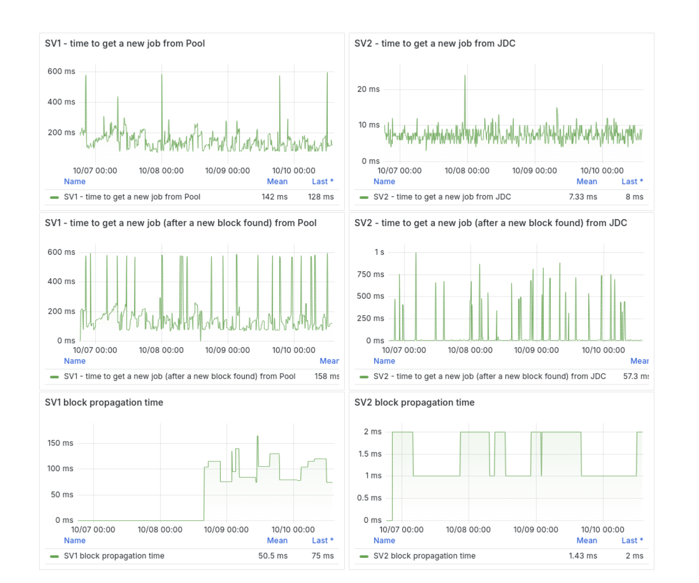

# Introduction

**The Next Generation of Bitcoin Mining Protocols**

Mining infrastructure is evolving. Stratum V2 promises significant improvements over the 10+ year old stratum V1 protocol—but does it deliver?

**What We'll Cover Today:**

- **Why Sv2?**: Quick overview of protocol improvements
- **Benchmarking Results**: Performance, latency, and efficiency findings from a 4-day testnet4 experiment
- **Sv2 Project Overview**: Infrastructure components, tooling, and ecosystem
- **Production Readiness**: Firmware support and deployment considerations
- **Future Implications**: What this means for Bitcoin mining

Is Stratum V2 ready for production, and should you care?

<!-- end_slide -->

# Why Stratum V2?

<!-- column_layout: [1, 1] -->

<!-- column: 0 -->

## Sv1

- Plain text JSON
- No standardization of protocol
- Disaggregated implementations/firmware
- No authentication - hashrate hijacking risk


<!-- column: 1 -->

## Sv2

- binary protocol - efficiency gain
- modular architecture - latency and composition gain
- formally define protocol spec - interoperability gain
- authentication and encryption - security gain
- Rust reference implementation - interoperability gain


### Sub-Protocols

- Mining
- Job Declaration
- Template Distribution

<!-- end_slide -->

# Benchmarking Overview

## Methodology

**Tool Suite**: [Stratum Mining benchmarking-tool](https://github.com/stratum-mining/benchmarking-tool)

- Created by GitGab19
- Docker-based architecture
- Configuration A (Job Declaration enabled)
- Sv2 Reference Implementation v1.5.0

**Infrastructure**:

- _On site_ VM: 16 vCPUs, 24GB RAM, 750GB SSD
- Ubuntu 22.04 + Docker v27.0
- Network latency injection to simulate real-world conditions

**Metrics Collection**:

- Prometheus + Grafana for visualization
- Custom proxies for latency measurement

<!-- end_slide -->

# Architecture Overview

<!-- column_layout: [1, 1] -->

<!-- column: 0 -->

## Sv2 Stack

```
Mining Devices
      ↓ (Sv1)
 Translator Proxy
      ↓ (Sv2)
Job Declaration Client (JDC)
      ↓ (Sv2)
Job Declaration Server (JDS)
      ↓
   Sv2 Pool
      ↓
Template Provider (Bitcoin Node)
```

<!-- column: 1 -->

## Sv1 Stack

```
Mining Devices
      ↓ (Sv1)
 Public Pool (ckpool?)
      ↓ (RPC)
Bitcoin Node
   (getblocktemplate)
```

<!-- end_slide -->

# Results: Latency

## Time to Get New Job & Block Propagation

| Metric                      | Sv1    | Sv2        | Improvement     |
| --------------------------- | ------ | ---------- | --------------- |
| **New Job**                 | 142ms  | **7.33ms** | **~19x faster** |
| **New Job after New Block** | 158ms  | **57.3ms** | **~3x faster**  |
| **Block Propagation**       | 50.5ms | **1.43ms** | **~35x faster** |

### Why This Matters

- **Reduced Wasted Hash**: Miners get new work faster
- **Better Block Propagation**: Higher chance to win chain splits
- **Scale Impact**: Critical for large operations

<!-- end_slide -->



<!-- end_slide -->

# Results: Share Acceptance

<!-- column_layout: [1, 1] -->

<!-- column: 0 -->

### Sv1

- **Acceptance Rate**: ~98.7% / (99.7% in Sep 2024)
- **Stale Shares**: 1114 / 82,870
- **Contributing Factors**:
  - Higher latency
  - Testnet4 timing issues

<!-- column: 1 -->

### Sv2

- **Acceptance Rate**: ~**100%**
- **Stale Shares**: 9 / 164,408
- **Contributing Factors**:
  - Lower latency
  - Faster job delivery

<!-- reset_layout -->

**Impact**: Even small improvements in acceptance rate translate to significant revenue at scale

<!-- end_slide -->


<!-- end_slide -->

# Results: Network Bandwidth

## Bandwidth Usage Trade-offs

<!-- column_layout: [1, 1] -->

<!-- column: 0 -->

### Farm Level (LAN)

- **Sv2**: Higher bandwidth usage

  - More network-connected daemons
  - JDC + Translator + Template Provider

- **Trade-off**: Bandwidth for latency
  - More local processing
  - Faster job distribution


<!-- column: 1 -->

### Pool Level (WAN)

- **Sv2**: Slightly less bandwidth

  - Efficient binary protocol
  - Still pushing a lot of template data

- **Sv1**: Slightly more bandwidth
  - JSON-RPC overhead
  - Frequent polling


<!-- reset_layout -->

---

**Assessment**: The bandwidth vs latency trade-off is **favorable** for Sv2

<!-- end_slide -->

# Project Overview: SRI Components

## Stratum V2 Reference Implementation

**Core Roles Implemented:**

- **Pool**: Centralized hashrate coordinator
- **Job Declaration Server (JDS)**: Block propagation and job data provider
- **Job Declaration Client (JDC)**: Miner-side job coordinator with fallback
- **Translator Proxy**: Sv1 ↔ Sv2 protocol translation
- **Template Provider**: Bitcoin Core v30 with multiprocess IPC

**Features:**

- Solo mining fallback if JDS connection lost
- Modular architecture for flexible deployment
- Open source reference implementation

**Resources:**

- **Protocol Spec**: [stratumprotocol.org](https://stratumprotocol.org)
- **Protocol Implementation**: [stratum-mining/stratum](https://github.com/stratum-mining/stratum)
- **Applications**: [stratum-mining/sv2-apps](https://github.com/stratum-mining/sv2-apps)

_Note: v1.5.0 moved applications to separate repo; migration finalizing in next release_

<!-- end_slide -->

# Firmware Support

<!-- column_layout: [1, 1] -->

<!-- column: 0 -->

## Current Sv2 Firmware

**Only 2 known Sv2-native implementations:**

1. **MARA Firmware** - tested in benchmarking
2. **Braiins OS** - tested in benchmarking


<!-- column: 1 -->

## Sv1 Compatibility Path

**Translator Proxy enables:**

- Sv1 firmware → Sv2 protocol
- No firmware upgrade required
- Maintains Sv2 benefits
- Used for all miners in the benchmarking

---

**Note**: While native Sv2 firmware exists, Translator enables broader adoption without firmware changes

<!-- end_slide -->

# Other Projects in the Ecosystem

**Outside the Reference Implementation**

- **Hashpool**: [hashpool.dev](https://hashpool.dev)
  - [Proxy Service](https://proxy.hashpool.dev)
- **DEMAND**: [dmnd.work](https://www.dmnd.work)
  - [PPLNS with Job Declaration](https://github.com/demand-open-source/pplns-with-job-declaration)
- **plebhash's Sv2 Services**: [github.com/plebhash/sv2-services](https://github.com/plebhash/sv2-services/tree/main)

## But what about DATUM!?!

[The Origins of DATUM](https://ocean.xyz/docs/datum)

- Accomplishes the same template generations as the JD protocol
- Idk C and Rust bitcoin ecosystem is robust
- Ocean still controls the coinbase and is custodial (dust, and firmware coinbase output)
- TIDES does not weigh block template

## Other stuff

[p2pool v2](https://github.com/p2poolv2/p2poolv2)

[braidpool](https://github.com/braidpool/braidpool)

<!-- end_slide -->

# Future Possibilities

## Imagine If...

<!-- pause -->

- more open source bitcoin mining developers
<!-- pause -->
- commoditized mining hardware
<!-- pause -->
- self hosted mining
<!-- pause  -->
- p2p mining pools
<!-- pause -->
- hashrate heating
<!-- pause -->
- coinbase games (address rolling)
<!-- pause -->
- permissionless hashrate marketplaces
<!-- pause -->
- subsidize your friends, not Antpool and Foundry
<!-- pause -->
- deep sea bitcoin mining

<!-- end_slide -->

# Questions & Resources

## Contact

**Gary Krause** aka average-gary

<!-- column_layout: [1, 1] -->

<!-- column: 0 -->

**Emails**

- gary.krause@mara.com
- gary@bitcoinveterans.org
- gary@virginiafreedom.tech

**Podcast**

- Motivate the Math - https://fountain.fm/show/EUp2eYCHEfZGhahs4YvJ

**Sites**

- github.com/average-gary
- bitcoinveterans.org
- primal.net/gary
- dcbitdevs.com
- shenandoahbitcoin.club
- virginiafreedom.tech

<!-- column: 1 -->

## Links

- **Stratum V2 Docs**: stratumprotocol.org
- **Stratum V2 Reference Implementation**: github.com/stratum-mining/stratum
- **Benchmarking Tool**: github.com/stratum-mining/benchmarking-tool
- **eHash** - hashpool.dev

# Thank You!

**Stratum V2**: The future of mining protocols
